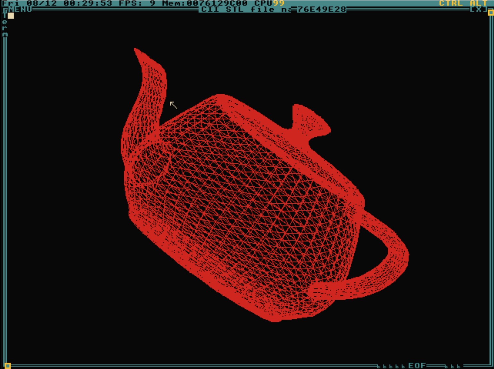

# temple-viewer

3D model viewer for TempleOS

## TempleOS basics

### One-time setup

Download the TempleOS ISO:  https://templeos.org/

Install QEMU for machine virtualization:  https://www.qemu.org/download/

Create a virtual disk (20GB is probably overkill):

    qemu-img create tdisk.img 20G

Install TempleOS:

    qemu-system-x86_64 -boot d -cdrom TempleOS.ISO -m 2048 -hda tdisk.img

Follow the TempleOS prompts to install it from the ISO to your virtual drive.

### Running TempleOS

    qemu-system-x86_64 tdisk.img -m 2048

### File transfer

Use ImDisk Toolkit to mount the virtual TempleOS drive and copy files to/from
your Windows host:  http://www.ltr-data.se/opencode.html/

## Running this viewer

After getting TempleOS running, copy [MAIN.HC](MAIN.HC) onto TempleOS.  Include it, then
view one of the provided STLs or any ASCII STL:

    StlView("/path/to/my/file.stl");

Also checkout the video demo:  https://www.youtube.com/watch?v=tHBgW9h7iKI

